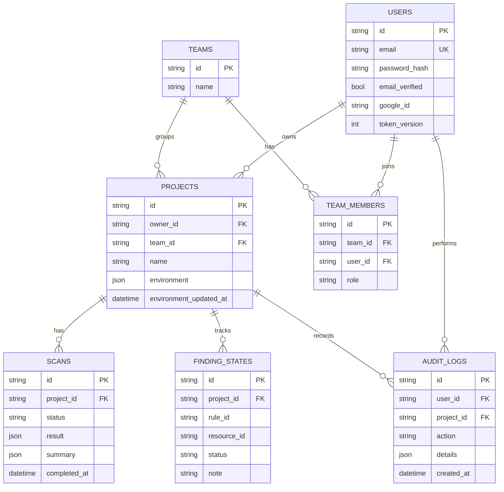

# Database ER diagram

```mermaid
erDiagram
  USERS ||--o{ PROJECTS : owns
  USERS ||--o{ TEAM_MEMBERS : joins
  USERS ||--o{ AUDIT_LOGS : performs
  TEAMS ||--o{ TEAM_MEMBERS : has
  TEAMS ||--o{ PROJECTS : groups
  PROJECTS ||--o{ SCANS : has
  PROJECTS ||--o{ FINDING_STATES : tracks
  PROJECTS ||--o{ AUDIT_LOGS : records
  USERS { string id PK string email UK string password_hash bool email_verified string google_id int token_version }
  TEAMS { string id PK string name }
  TEAM_MEMBERS { string id PK string team_id FK string user_id FK string role }
  PROJECTS { string id PK string owner_id FK string team_id FK string name json environment datetime environment_updated_at }
  SCANS { string id PK string project_id FK string status json result json summary datetime completed_at }
  FINDING_STATES { string id PK string project_id FK string rule_id string resource_id string status string note }
  AUDIT_LOGS { string id PK string user_id FK string project_id FK string action json details datetime created_at }
```
