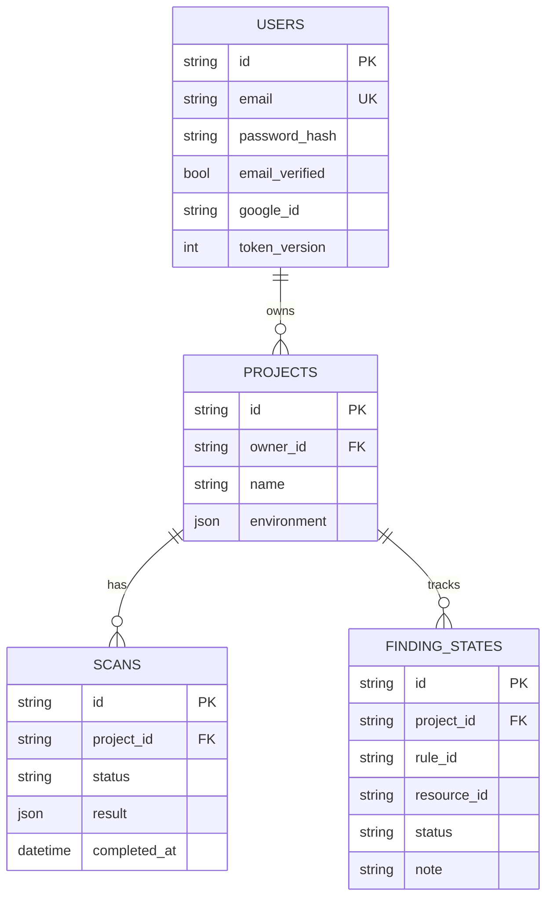

# Database ER diagram

```mermaid
erDiagram
  USERS ||--o{ PROJECTS : owns
  PROJECTS ||--o{ SCANS : has
  PROJECTS ||--o{ FINDING_STATES : tracks
  USERS { string id PK string email UK string password_hash bool email_verified string google_id int token_version }
  PROJECTS { string id PK string owner_id FK string name json environment }
  SCANS { string id PK string project_id FK string status json result datetime completed_at }
  FINDING_STATES { string id PK string project_id FK string rule_id string resource_id string status string note }
```
